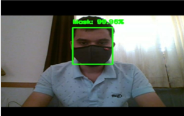

# Real-Time-Face-Mask-Detection-and-Social-Distance-Monitoring

The proposed system helps to ensure the safety of the people at public places by automatically monitoring them whether they maintain a safe social distance, and also by detecting whether or not an individual wears a face mask. We successfully achieved an accuracy of about 99% for our model, If you have High Quality Cameras then it will accurately detect each and every person's mask and will monitor the Social Distance of all the persons present in the frame. We can install this model into CCTV using raspberry pi4 with a camera to automatically track people and monitor social distance and detect people's Face Mask, so that we can reduce the spread of COVID-19.

# Software and Hardware Requirements 
1. Software : Anaconda + Python 3.x (3.8 or earlier)
2. Editor : VS Code/ PyCharm/ Sublime/ Spyder
3. HARDWARE: GPU : Graphics Processor (NVIDIA) min 2GB
             Camera : CCTV/ Webcam/ Mobile Camera 
             Storage Disk : SSD - Min 400MB/s Read Speed

# Methodology
1. The proposed system uses a transfer learning approach to performance optimization with a deep learning algorithm and a computer vision to automatically monitor people in public places with a camera integrated with a raspberry pi4 and to detect people with mask or no mask
2. We have used the MobileNetV2 architecture as the core model for detection, as MobileNetV2 provides a huge cost advantage compared to the normal 2D CNN model.
3. We are loading the MobileNet V2 with pre-trained ImageNet weights, leaving the network head off and constructing a new FC head, attaching it to the base instead of the old head, and freezing the base layers of the network.
4. Real-time person detection is done with the help of Single Shot object Detection (SSD).A bounding box will be displayed around every person detected.
5. We after that calculate distance between all the persons detected in video. If the distance between two people is less than 2 meters, a red bounding box is shown around them, indicating that they do not maintain a social distance.
6. We used custom face crop datasets of about 1376  images annotated in mask and no mask created by prajna bhandari.
7. The result of the SSD model extracts a person mask and displays a bounding box.
8. The proposed system monitors public places continuously and when a person without a mask is detected  his or her face will be highlighted and at the same time the distance between individuals is measured in real time. 
9. Deploying our model to edge devices for automatic monitoring of public places could reduce the burden of physical monitoring, which is why we choose to use this architecture.

# Algorithms Implemented
1. In Data Visualization we visualize the total number of images in our dataset
that is there are 690 images in the with mask class and 686 images in the without_mask class. And after that we split our data into the training set which will contain the images on which the CNN model will be trained and the test set with the images on which our model will be tested.
2. OpenCV and Tensorflow has played a major role in our model for real time video processing. It is used to detect objects, faces, Face Mask etc. in real time video.
3. YOLOv3 was used for Social distance module, YOLO stands for (You Only Look Once).It is a real-time object detection algorithm that identifies specific objects in videos, live feeds, or images.
In our Social Distance Monitoring model we have used YOLO to detect Persons in real time video.

# Output

